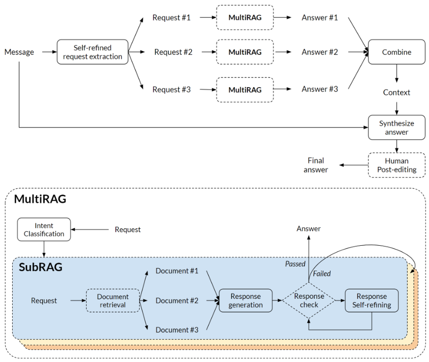

# LuxAI Chatbot with Azure OpenAI and Cognitive Search

This is a Chatbot used for internal customer email answering at LuxAI.



## Features

* Chat interfaces


## Getting Started

> **IMPORTANT:** In order to deploy and run this project, you'll need an **Azure subscription with access enabled for the Azure OpenAI service**. 

### Prerequisites

#### To Run Locally

* [Azure Developer CLI](https://aka.ms/azure-dev/install)
* [Python 3+](https://www.python.org/downloads/)
  * **Important**: Python and the pip package manager must be in the path in Windows for the setup scripts to work.
  * **Important**: Ensure you can run `python --version` from console. On Ubuntu, you might need to run `sudo apt install python-is-python3` to link `python` to `python3`.
* [Node.js 14+](https://nodejs.org/en/download/)
* [Git](https://git-scm.com/downloads)
* [Powershell 7+ (pwsh)](https://github.com/powershell/powershell) - For Windows users only.
  * **Important**: Ensure you can run `pwsh.exe` from a PowerShell command. If this fails, you likely need to upgrade PowerShell.

>NOTE: Your Azure Account must have `Microsoft.Authorization/roleAssignments/write` permissions, such as [User Access Administrator](https://learn.microsoft.com/azure/role-based-access-control/built-in-roles#user-access-administrator) or [Owner](https://learn.microsoft.com/azure/role-based-access-control/built-in-roles#owner).  

#### To Run in VS Code Remote Containers

You can run this repo virtually in VS Code Remote Containers.  Click on the button below to open this repo in Container.

[Remote Development extension pack](https://marketplace.visualstudio.com/items?itemName=ms-vscode-remote.vscode-remote-extensionpack)

[](https://vscode.dev/redirect?url=vscode://ms-vscode-remote.remote-containers/cloneInVolume?url=https://github.com/trislee02/azure-search-openai)

### Installation

#### Starting from scratch

**Important**: This step will provision a completely new Azure resource. If you do not want it, skip this step.

Execute the following command, if you don't have any pre-existing Azure services and want to start from a fresh deployment.

1. Run `azd up` - This will provision Azure resources and deploy this sample to those resources, including building the search index based on the files found in the `./data` folder.
    * For the target location, the regions that currently support the models used in this sample are **East US**, **South Central US**, and **West Europe**. For an up-to-date list of regions and models, check [here](https://learn.microsoft.com/azure/cognitive-services/openai/concepts/models#model-summary-table-and-region-availability).
1. After the application has been successfully deployed you will see a URL printed to the console.  Click that URL to interact with the application in your browser.  

It will look like the following:


> NOTE: It may take a minute for the application to be fully deployed. If you see a "Python Developer" welcome screen, then wait a minute and refresh the page.

#### Using existing resources

You can create your own Azure resource and services needed. All services must have the tag `azd-env-name` holding the name of current environment. Additionally, Azure App Service must have one more tag `azd-service-name` holding the service name in the `azure.yml`. For instance, the service name is 'backend' then, the `azd-service-name` is 'backend'.

Then, update the environment variables. Go to environment environment file at `.azure/<environment_name>/.env` and configure following variables:
```
AZURE_ENV_NAME=""
AZURE_STORAGE_ACCOUNT=""
AZURE_STORAGE_ACCOUNT_KEY=""
AZURE_STORAGE_CONTAINER=""

AZURE_SEARCH_SERVICE=""
AZURE_SEARCH_SERVICE_KEY=""
AZURE_SEARCH_INDEX_LUXAI=""
AZURE_SEARCH_INDEX_CODE=""
AZURE_SEARCH_INDEX_ROS=""
AZURE_SEARCH_INDEX_EMAIL=""

# AZURE_OPENAI_KEY=""
AZURE_OPENAI_SERVICE=""
AZURE_OPENAI_GPT_35_DEPLOYMENT=""
AZURE_OPENAI_CHATGPT_35_DEPLOYMENT=""
AZURE_OPENAI_CHATGPT_35_MODEL=""
AZURE_OPENAI_EMB_DEPLOYMENT=""

OPENAI_API_VERSION=""
```

> If you don't have any environment already, create by running

```azd env new <your new environment name>```

### Preparing external data for RAG

1. Create a directory named `data` at the root. See `sample-data` folder as a reference.
1. Create a sub-directory for each indexes.
1. Place document files in those sub-directories.
1. Move to `scripts` folder. Run `cd scripts`.
1. Run `./prepdocs.sh`

### Running locally

1. Run `azd login`
2. Change dir to `app`
3. Run `./start.ps1` or `./start.sh` or run the "VS Code Task: Start App" to start the project locally.

#### Sharing Environments

To give someone else access to a completely deployed and existing environment,
either you or they can follow these steps:

1. Install the [Azure CLI](https://learn.microsoft.com/cli/azure/install-azure-cli)
1. Run `azd init -t azure-search-openai-demo` or clone this repository.
1. Run `azd env refresh -e {environment name}`
   They will need the azd environment name, subscription ID, and location to run this command. You can find those values in your `.azure/{env name}/.env` file.  This will populate their azd environment's `.env` file with all the settings needed to run the app locally.
1. Set the environment variable `AZURE_PRINCIPAL_ID` either in that `.env` file or in the active shell to their Azure ID, which they can get with `az account show`.
1. Run `./scripts/roles.ps1` or `.scripts/roles.sh` to assign all of the necessary roles to the user.  If they do not have the necessary permission to create roles in the subscription, then you may need to run this script for them. Once the script runs, they should be able to run the app locally.

### Quickstart

* In Azure: navigate to the Azure WebApp deployed by azd. The URL is printed out when azd completes (as "Endpoint"), or you can find it in the Azure portal.
* Running locally: navigate to 127.0.0.1:5000

Once in the web app:

* Try different topics in chat or Q&A context. For chat, try follow up questions, clarifications, ask to simplify or elaborate on answer, etc.
* Explore citations and sources
* Click on "settings" to try different options, tweak prompts, etc.

### Deploying

If you've only changed the backend/frontend code in the `app` folder, then you don't need to re-provision the Azure resources. You can just run:

```azd deploy```